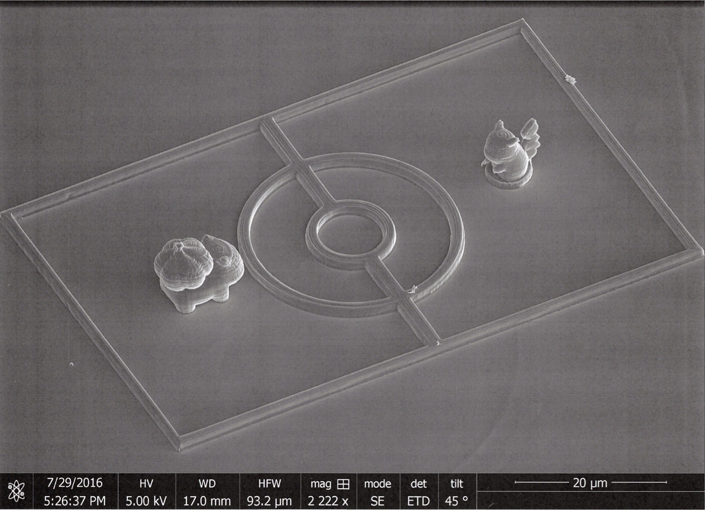

<link rel="stylesheet" href="//cdnjs.cloudflare.com/ajax/libs/KaTeX/0.1.1/katex.min.css">
<script src="//cdnjs.cloudflare.com/ajax/libs/KaTeX/0.1.1/katex.min.js"></script>
<script src="https://cdn.mathjax.org/mathjax/latest/MathJax.js?config=TeX-AMS-MML_HTMLorMML" type="text/javascript"></script>


<!-- Parse the Latex divs with Katex-->
<script type="text/javascript">
  $("script[type='math/tex']").replaceWith(
    function(){
      var tex = $(this).text();
      return katex.renderToString(tex, {displayMode: false});
  });
  
  $("script[type='math/tex; mode=display']").replaceWith(
    function(){
      var tex = $(this).text();
      return katex.renderToString(tex.replace(/%.*/g, ''), {displayMode: true});
  });
</script>


# Title

## section

code snippet
```python
def something():
    pass
```


### subsection

latex


we can test a formula $$abc + d$$

[link to another page](test.md)

add an image:

